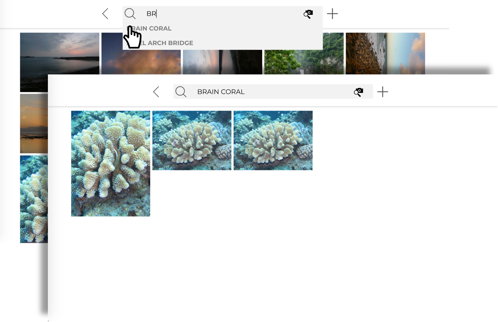

> Note: Due to cost and I need to host another on-going project, this website is no longer served online

# Cloud-photo-album
A demo photo album featuring search by image using deep feature learning.

## Demo Video (click to watch)
[](https://youtu.be/bawuL6eBYGw "Demo")

---
## Features
### :one: Auto-labeling when uploading images

### :two: Search by Text

### :three: Search by Image


---
## Architecture


---
## Install and Run
1. Get off-the-shelf dependencies 
```shell
pip install -r requirements.txt
```
2. Get [my paper work on retrieval using caffe](https://github.com/HughKu/caffe-retrieval.git)
```shell
git clone https://github.com/HughKu/caffe-retrieval.git
```
3. Run Django Server
```shell
cd my_website
python manage.py runserver 8002
```
4. Open web browser and enter the following URL 
```shell
http://localhost:8002/work/photo-album-alpha/
```
